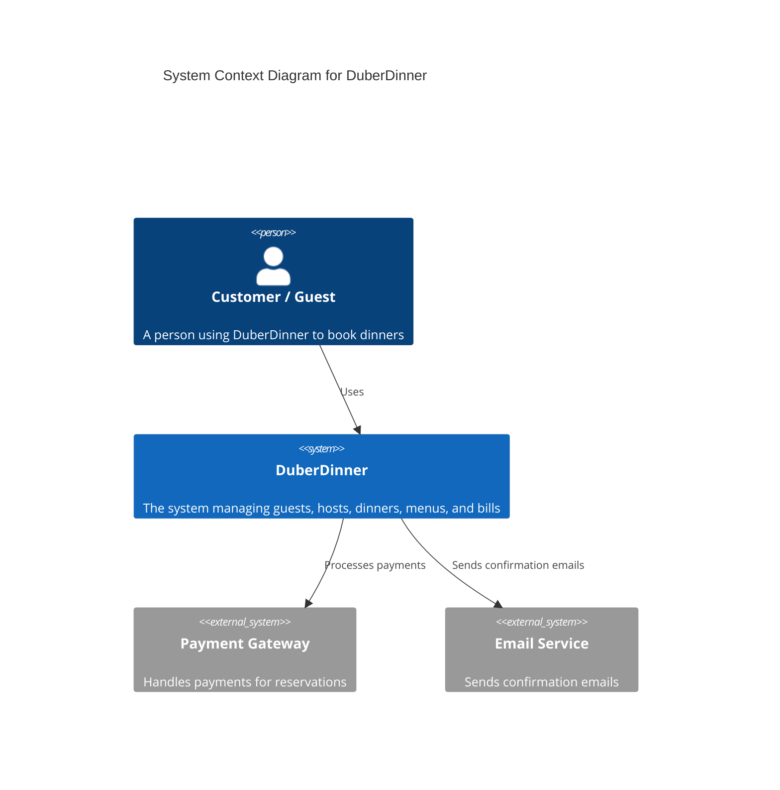

## Context


## Container
```mermaid

C4Container
  title DuberDinner Container Diagram
  Person(guest, "Guest", "A person who books dinners")
  Person(host, "Host", "A person who organizes dinners")

  Container(webApp, "Web App", "Frontend", "Allows users to view and book dinners")
  Container(apiService, "API Service", "Application Layer", "Handles commands, queries, and orchestrates domain logic")
  ContainerDb(database, "Database", "Relational DB", "Stores all aggregates and entities")

  Rel(guest, webApp, "Uses")
  Rel(host, webApp, "Uses")
  Rel(webApp, apiService, "Calls")
  Rel(apiService, database, "Reads/Writes")


  ```

## Component
```mermaid

C4Component
  title DuberDinner API Service Components (Domain Focused)

  Container(apiService, "API Service", "Application Layer")

  Component(HostAggregate, "Host", "")
  Component(GuestAggregate, "Guest", "")
  Component(DinnerAggregate, "Dinner", "")
  Component(MenuAggregate, "Menu", "")
  Component(BillAggregate, "Bill", "")

  Rel(HostAggregate, DinnerAggregate, "Organizes")
  Rel(DinnerAggregate, MenuAggregate, "Includes / References")
  Rel(DinnerAggregate, BillAggregate, "Generates")
  Rel(GuestAggregate, DinnerAggregate, "Books / Participates")
  Rel(GuestAggregate, MenuAggregate, "Reviews")


  ```
## Code
```mermaid

classDiagram

%% Aggregates
class Host {
    <<AggregateRoot>>
    +HostId : Guid
    +UserId : Guid
}

class Menu {
    <<AggregateRoot>>
    +MenuId : Guid
    +HostId : Guid
}

class Dinner {
    <<AggregateRoot>>
    +DinnerId : Guid
    +HostId : Guid
    +MenuId : Guid
}

class Bill {
    <<AggregateRoot>>
    +BillId : Guid
    +DinnerId : Guid
}

class Guest {
    <<AggregateRoot>>
    +GuestId : Guid
    +UserId : Guid
}

class MenuReview {
    <<AggregateRoot>>
    +MenuReviewId : Guid
    +MenuId : Guid
    +HostId : Guid
    +GuestId : Guid
}

class GuestRating {
    <<Entity>>
    +RatingId : Guid
    +GuestId : Guid

}

class Reservation {
    <<Entity>>
    +ReservationId : Guid
    +DinnerId : Guid
}

class User {
    <<AggregateRoot>>
    +UserId : Guid
    +HostId : Guid
    +GuestId : Guid
}

%% Relationships between aggregates
Host "1" --> "*" Menu : manages
Menu "1" --> "*" Dinner : includes
Host "1" --> "*" Dinner : organizes
Dinner "1" --> "*" Bill : generates
Dinner "1" *-- "*" Reservation : has
Guest "1" *-- "*" GuestRating : has
MenuReview "*" --> "1" Menu : reviews
MenuReview "*" --> "1" Guest : writtenBy
Guest "1" --> "1" User : BelongsTo
Host "*" --> "1" User : linkedTo

```
